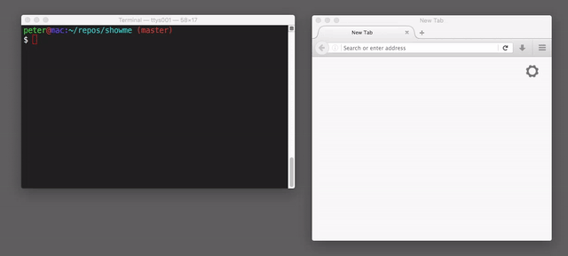

[](http://standardjs.com/)
[](https://travis-ci.org/pmorjan/showme)

# showme

### Watch your terminal session live on the web



### Run via publicly available Docker image
```sh
docker run -ti pmorjan/showme
```

### Installation
Requires [Node.js](https://nodejs.org/) and a C++ Compiler
```sh
npm install -g
```

### Usage
```
Usage: showme [shell]

Examples:
  showme
  showme /bin/csh
```
